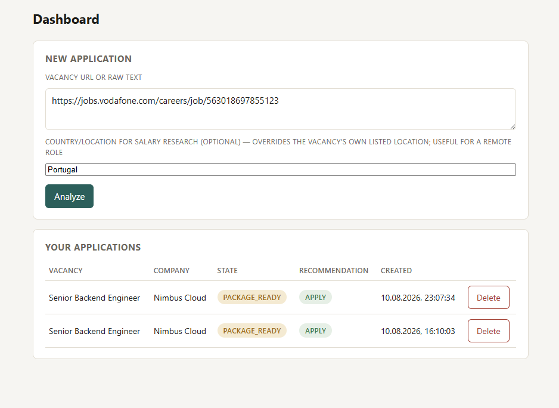
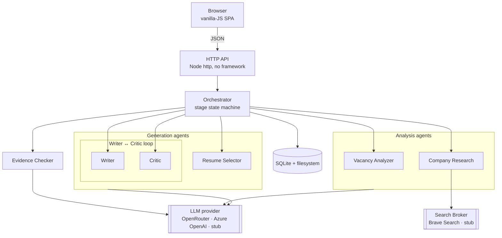

# RoleCase

[](https://github.com/torselllo88/rolecase/actions/workflows/ci.yml)
[](LICENSE)

An AI assistant for evaluating job opportunities and drafting tailored applications, with human approval at every step.

## Table of contents

- [What it is](#what-it-is)
- [Why RoleCase](#why-rolecase)
- [How it works](#how-it-works)
- [Key capabilities](#key-capabilities)
- [Screenshots](#screenshots)
- [Architecture](#architecture)
- [Design decisions](#design-decisions)
- [Tech stack](#tech-stack)
- [Getting started](#getting-started)
- [Configuration](#configuration)
- [Security notes](#security-notes)
- [Illustrative example](#illustrative-example)
- [Limitations](#limitations)

## What it is

RoleCase turns a job posting into a structured application workflow. It evaluates
role fit, researches the company, recommends whether to apply, then prepares
tailored application materials using a profile you provide — your resumes, past
cover letters, and past answers. It's designed as a decision-support tool, not an
autonomous application bot: nothing is generated, and nothing is submitted,
without your explicit approval.

## Screenshots

<!-- Add real screenshots to docs/screenshots/ — see docs/screenshots/README.md for expected filenames. -->



More: [Role assessment](docs/screenshots/role-assessment.png) ·
[Application workspace](docs/screenshots/workspace.png) ·
[Drafting](docs/screenshots/drafting.png) ·
[Workbenches](docs/screenshots/workbenches.png) (optional)

## Why RoleCase

Most "AI job application" tools skip straight to generation. Three problems with that:

- **Generic LLMs produce plausible but weakly grounded text.** Asked to write a
  cover letter, a model will confidently invent achievements, numbers, and
  experience that aren't in your background if it isn't given anything real to
  ground itself in.
- **A useful recommendation needs context about both the role and the
  candidate** — not just the vacancy text, and not just a resume in isolation, but
  how the two actually match.
- **Automated submission removes the one decision point that matters most**:
  whether this specific application is worth sending at all.

RoleCase is built around these constraints rather than despite them. Analysis is
a separate stage from writing — the system tells you whether a role looks worth
pursuing *before* spending any effort drafting materials for it — and every
transition between stages waits for an explicit approval. A dedicated Evidence
Checker agent cross-references every claim in the generated text against your
actual resume, flagging anything that isn't backed by something real.

## How it works

```
Job URL / description
  → Role analysis
  → Company research
  → Fit assessment
  → Human decision (approve / reject)
  → Application planning (resume selection)
  → Drafting (cover letter + answers)
  → Critique / revision (writer–critic loop)
  → Human review (accept / regenerate / mark as applied)
```

RoleCase never submits an application on your behalf. The final step is always a
manual "mark as applied" — there is no browser automation, no auto-submit.

## Key capabilities

- **Job & company analysis** — parses the posting and researches the company
  (culture signals, risks, salary range) via live web search.
- **Candidate–role fit assessment** — a scored recommendation (apply / apply with
  caution / reject) with reasoning, before any application material is drafted.
- **Resume selection** — picks the best-matching resume from your own library of
  variants for each specific role.
- **Tailored cover letter & application-question drafting** — grounded in your
  resume, past cover letters, and past answers, not generic filler.
- **Iterative writer/critic loop** — a second agent reviews every draft for weak
  arguments, unsupported claims, and ATS issues, and sends it back for revision
  until it clears a quality bar (or hits a configurable iteration cap).
- **Full execution traceability** — every run keeps a complete trace of every
  agent call, tool call, and model call, with token usage, cost, and duration.

## Architecture



- **UI** — a small vanilla-JS single-page app (no framework, no build step),
  talking to the backend over plain JSON endpoints.
- **API / HTTP layer** — a lightweight router over Node's built-in `http` module,
  kept intentionally small rather than pulled in via a framework: handles auth,
  workspace routing, and request validation with no middleware-chain indirection
  to reason about, and one fewer dependency to audit and patch.
- **Orchestrator** — the state machine driving each application through its
  stages; the only component that wires agents together (agents never call each
  other directly).
- **Agents / workflows** — six single-responsibility agents: Vacancy Analyzer,
  Company Research, Resume Selector, Writer, Critic, Evidence Checker.
- **Model abstraction** — a small provider interface with OpenRouter and Azure
  OpenAI implementations; every agent goes through it, and every agent falls back
  to a deterministic stub when no provider is configured.
- **External research / search** — a centralized Search Broker (Brave Search),
  with caching, rate limiting, and the same stub fallback.
- **Persistence / configuration** — SQLite for run state and settings; the
  filesystem for generated artifacts (reports, packages, execution traces) and
  profile data (resumes, cover letters, answer examples, notes).

RoleCase uses a staged workflow rather than a fully autonomous agent. Each stage
has a constrained responsibility and produces structured output consumed by the
next stage — there's no single agent loop deciding what to do next; the
orchestrator does, deterministically.

## Design decisions

**Human-in-the-loop by design.** Every stage transition — approve the analysis,
accept the package, mark as applied — is a manual action. There's no "auto-apply"
mode, and adding one isn't a goal.

**Analysis is separate from generation.** Drafting a full application package is
the most expensive step (multiple LLM calls, iterative revision). The system
decides whether a role is worth pursuing first, and only spends that effort after
you approve — instead of generating full materials for every posting up front.

**Structured candidate context, not a giant prompt.** Resume text, past cover
letters, past answers, and free-form notes are each their own labeled input to
the Writer agent, rather than one undifferentiated blob of "here's everything
about the candidate." The same structure lets the Evidence Checker verify
specific claims against a specific source.

**Writer–critic loop with progressive locking.** The Critic checks each piece
independently for weak arguments, unsupported claims, and length; anything that
already passed is locked and excluded from further review, so later iterations
only spend effort on pieces that still need work — capped at a configurable
number of rounds.

**Model/provider abstraction.** OpenRouter and Azure OpenAI are both first-class,
swappable per deployment and per agent — the system isn't wired to one vendor,
and degrades to a deterministic stub rather than failing outright when nothing is
configured.

**Multi-tenant workspace isolation.** Admin, a public demo, and any number of
password-gated workbenches for other people run in the same process but never
share data, LLM keys, or search results — enforced via per-request context
propagation, not convention.

**Cost governance as a first-class setting.** The refinement loop's iteration
cap, which LLM model each agent uses, and how many expensive actions a workspace
may trigger per hour are all configurable per workspace — added directly in
response to a real gap: a workbench's owner had no way to control what they were
spending.

## Tech stack

TypeScript · Node.js (no framework, no build step) · OpenRouter / Azure OpenAI ·
Brave Search · SQLite · Vitest · Model Context Protocol (MCP) SDK

## Getting started

```
git clone https://github.com/torselllo88/rolecase.git
cd rolecase
npm start
```

That's it for a first look — `npm start` installs dependencies and launches the
GUI at `http://localhost:3939`. It works with **zero configuration**: without a
`.env`, every agent falls back to a deterministic stub (no crash, no real API
calls), so you get a fully working, click-through demo immediately.

**Prerequisites**: [Node.js](https://nodejs.org/) ≥ 22.5.0.

**For real LLM calls**, copy `.env.example` to `.env` and fill in an OpenRouter or
Azure OpenAI key — or skip `.env` entirely and set a provider/key from the GUI
itself, in Admin → Settings.

Longer version, if you want to run steps individually or use the CLI instead:

1. `npm run setup` (currently just `npm install`).
2. Copy `.env.example` → `.env` if you want real LLM/search calls; fill in keys.
   **Never commit a populated `.env`** — it's gitignored on purpose.
3. `npm test` to confirm a clean install — the suite is fully hermetic (it never
   touches your real `.env`), so it passes with zero keys configured.
4. Use it:
   - `npm run gui` — the web GUI (the primary way to use this day to day).
   - `npm run cli` — command-line interface.
   - `npm run mcp` — an MCP server exposing the same tools to any MCP-compatible client.

## Configuration

**Your profile** (resumes, writing style, past answers, other background) —
manage from **Admin** in the GUI (upload/add/edit/delete, no file editing
needed), or drop files by hand into `data/resumes/`, `data/cover-letters/`,
`data/answer-examples/`, `data/candidate-notes/` — each folder has its own
`README.md` explaining the expected format. All four are optional and gitignored;
your content never leaves your machine unless you configure a real LLM/search
provider.

**LLM & search providers** — set OpenRouter and/or Azure OpenAI, and a Brave
Search key, either in `.env` (see `.env.example`) or from Admin → Settings (a
value set in the GUI wins over `.env`). Leave everything unset and the whole
system runs on deterministic stubs — no crash, no real calls, no cost.

**Multi-workspace mode** — set `ADMIN_PASSWORD` in `.env` to password-gate the
admin panel and unlock an optional public demo (`ENABLE_DEMO=true`) and any
number of admin-managed "workbenches" for other people, each with fully isolated
data, settings, and (optionally) their own LLM key. Off by default: with no
`ADMIN_PASSWORD`, this is a single unauthenticated instance, exactly as if the
feature didn't exist.

**What's local, what's not** — everything lives under `./data/` (override with
`DATA_DIR`): a SQLite file for run state/settings, and plain files for generated
reports/packages/traces and your profile content. Nothing is sent anywhere except
to whichever LLM/search provider you've configured.

## Security notes

- **API keys are stored in plaintext** in the local SQLite settings database,
  whether set via `.env` or the Admin/Workbench Settings UI. That's fine as
  long as `data/` stays on your machine — it's gitignored by default — but
  don't commit, publish, or share that file.
- **Legacy mode (no `ADMIN_PASSWORD` set) has no rate limiting** on expensive
  actions like analysis and drafting — it's built assuming a single trusted
  local user. If you expose it beyond `localhost`, that assumption no longer
  holds.
- **The session cookie isn't marked `Secure` unless you set
  `COOKIE_SECURE=true`.** That's correct for local HTTP use. If you run
  multi-workspace mode (admin/demo/workbenches) behind a real domain, set
  `COOKIE_SECURE=true` and put TLS in front of it — otherwise the session
  cookie travels unencrypted.
- A handful of transitive, dev-only `npm audit` findings (via Vitest 3) are
  currently unaddressed pending a Vitest 4 upgrade; they affect the test
  toolchain only, not the running application.

## Illustrative example

*A synthetic walkthrough for illustration — not a real run or real candidate data.*

**Input**: "Senior Technical Product Manager, AI/ML" posting, pasted as raw text.

**Analysis**: fit score 82/100 → **APPLY** → approved.

**After approval**: resume selector picks the best-matching variant on file. The
writer/critic loop drafts a cover letter and two application answers, revising
once after the Critic flags generic phrasing. The Evidence Checker catches one
unsupported claim ("led a team of 12" — not in the resume) before the piece is
marked converged.

**Output**: cover letter, two application answers, an evidence map, and a full
execution trace — ready for a final human read before marking the application as
submitted.

## Limitations

- Quality depends heavily on how complete your candidate profile is — a thin
  resume with no past answers on file means thinner grounding for the Writer.
- Company research depends on public information available via web search; it
  can miss recent news or be wrong about a small/private company.
- Recommendations are advisory, not authoritative — the fit score and
  apply/reject verdict are a starting point for your own judgment, not a
  substitute for it.
- LLM output still requires review. The Critic and Evidence Checker catch a lot,
  not everything.
- There is no automated submission — every application is submitted by you,
  manually, outside this tool.
- This isn't built to maximize application volume; the explicit approval gates
  make that a deliberately bad fit for spray-and-pray applying.

Not affiliated with or endorsed by OpenAI, Anthropic, OpenRouter, or Brave
Search — this project is an independent client of their public APIs, referenced
here only to describe what it connects to.

## License

Apache-2.0 — see [LICENSE](LICENSE).
